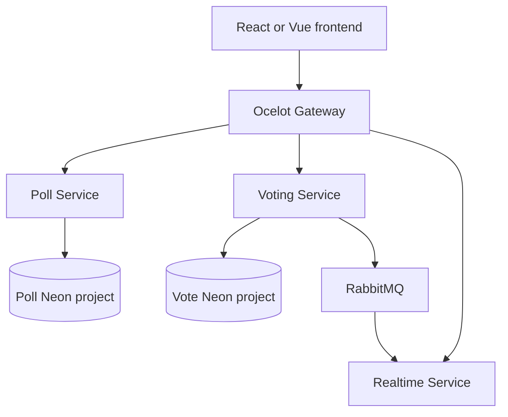

# Poll & Survey Builder — Backend

.NET 10 backend for the AMD201 Poll & Survey Builder. It uses PostgreSQL hosted
on Neon, Entity Framework Core, Ocelot, RabbitMQ and SignalR. Account
authentication remains future development; poll management is protected by a
creator token returned when a poll is created.

## Live URLs
 - Frontend: [https://amd201.onrender.com](https://amd201.onrender.com)
 - Backend: [https://poorpollsurvey.up.railway.app/](https://poorpollsurvey.up.railway.app/)

## Docker Hub Images
 - REPO: [repo](https://hub.docker.com/repositories/duckbruh)
 - API Gateway: [poll-api-gateway](https://hub.docker.com/repository/docker/duckbruh/poll-api-gateway/general)
 -  Poll Service: [poll-service](https://hub.docker.com/repository/docker/duckbruh/poll-service/general)
 -  Voting Service: [voting-service](https://hub.docker.com/repository/docker/duckbruh/voting-service/general)
 -  Realtime Service: [realtime-service](https://hub.docker.com/repository/docker/duckbruh/realtime-service/general)
   
## Architecture



All browser requests use `http://localhost:8080`. The service ports are exposed
only for development and OpenAPI inspection.

| Component | Responsibility | Development port |
| --- | --- | ---: |
| API Gateway | Public API and WebSocket routes | 8080 |
| Poll Service | Poll CRUD and creator authorization | 8081 |
| Voting Service | Vote submission and result aggregation | 8082 |
| Realtime Service | SignalR result broadcasts | 8083 |
| RabbitMQ | Realtime vote events | 5672 |
| RabbitMQ management | Development message inspection | 15672 |

## Neon PostgreSQL ownership

Use two separate Neon projects:

| Service | Neon project | Tables |
| --- | --- | --- |
| PollService | Poll project | `polls`, `poll_options` |
| VotingService | Vote project | `votes` |

Two databases in one Neon project are logically separate but share the same
project availability. Two Neon projects provide stronger isolation: PollService
can continue when the Vote project is unavailable, and a Poll project outage
does not take down the Vote database itself. Voting still calls PollService to
validate the poll and option, so new vote requests require both services to be
reachable.

The local PostgreSQL Docker container has been removed. Docker now runs the
backend services and RabbitMQ, while both PostgreSQL databases are hosted in
Neon.

## Configure Neon

1. Create a Neon project for PollService.
2. Create a second Neon project for VotingService.
3. In each project, open **Connect** and copy the .NET/Npgsql connection string.
4. Copy the environment template:

```powershell
Copy-Item .env.example .env
```

5. Replace both example values in `.env`:

```env
POLL_DB_CONNECTION_STRING=Host=YOUR_POLL_HOST;Database=neondb;Username=YOUR_USER;Password=YOUR_PASSWORD;SSL Mode=Require;Channel Binding=Require
VOTE_DB_CONNECTION_STRING=Host=YOUR_VOTE_HOST;Database=neondb;Username=YOUR_USER;Password=YOUR_PASSWORD;SSL Mode=Require;Channel Binding=Require
```

Use the direct Neon connection strings for this coursework build because the
services create their schemas during startup. Do not commit `.env`; it is
already excluded by `.gitignore`.

Existing records from the old local PostgreSQL container are not copied
automatically. The new Neon databases start empty.

## Run

Requirements:

- Docker Desktop with Docker Compose
- Two configured Neon projects
- Ports 5672, 15672 and 8080–8083 available

From the solution directory:

```powershell
docker compose up -d --build
docker compose ps
docker compose logs poll-service voting-service --tail 100
```

The services create the required tables when they first connect to the empty
Neon databases.

Stop the local containers:

```powershell
docker compose down
```

This does not delete Neon data.

OpenAPI:

- PollService: `http://localhost:8081/openapi/v1.json`
- VotingService: `http://localhost:8082/openapi/v1.json`

## CRUD API

| Operation | Method and gateway path | Authorization |
| --- | --- | --- |
| Create | `POST /polls` | Public |
| Read | `GET /polls/{code}` | Public |
| Update | `PUT /polls/{code}` | Creator token |
| Delete | `DELETE /polls/{code}` | Creator token |
| Close | `PATCH /polls/{code}/close` | Creator token |

### Create

```http
POST http://localhost:8080/polls
Content-Type: application/json
```

```json
{
  "question": "Which option do you prefer?",
  "options": ["Option A", "Option B"]
}
```

Success: `201 Created`

```json
{
  "code": "7fGh2Ab",
  "creatorToken": "private-token-returned-once",
  "sharePath": "/poll/7fGh2Ab",
  "createdAt": "2026-07-28T08:00:00+00:00"
}
```

The frontend must keep `creatorToken` private. Do not include it in the shared
poll URL. Without account authentication, losing the token means losing the
ability to update, close or delete that poll.

### Read

```http
GET http://localhost:8080/polls/7fGh2Ab
```

The poll and option IDs are public because voters require them.

### Update — creator only

```http
PUT http://localhost:8080/polls/7fGh2Ab
Content-Type: application/json
```

```json
{
  "creatorToken": "private-token-returned-by-create",
  "question": "Updated question?",
  "options": ["Updated Option A", "Updated Option B"]
}
```

Success: `200 OK`. An invalid or missing creator token returns `403 Forbidden`.
A closed poll returns `409 Conflict`.

The option count cannot be changed after creation. Update can change the
question and option text, while preserving option IDs so existing votes remain
valid.

### Delete — creator only

```http
DELETE http://localhost:8080/polls/7fGh2Ab
X-Creator-Token: private-token-returned-by-create
```

Success: `204 No Content`. Invalid or missing tokens return `403 Forbidden`.
Deleted polls return `404 Not Found` from later read, vote and result requests.

Deletion is implemented as a soft delete. This prevents the short code from
being reused accidentally and keeps old vote rows from becoming attached to a
different poll.

### Close — creator only

```http
PATCH http://localhost:8080/polls/7fGh2Ab/close
Content-Type: application/json
```

```json
{
  "creatorToken": "private-token-returned-by-create"
}
```

Success: `204 No Content`.

## Voting and results

Submit a vote:

```http
POST http://localhost:8080/polls/7fGh2Ab/vote
Content-Type: application/json
```

```json
{
  "optionId": "69fd6ef0-f5c9-4831-94fb-d4307fb6289c"
}
```

Get results:

```http
GET http://localhost:8080/polls/7fGh2Ab/results
```

The frontend must use `credentials: "include"` for vote requests so the
HttpOnly voter cookie is retained. A unique database constraint on
`pollCode + voterTokenHash` enforces one vote per browser.

## SignalR

Gateway hub URL:

```text
http://localhost:8080/hubs/polls
```

Client method: `WatchPoll(code)`

Server event: `ResultsUpdated`

## Test

Use `PollSurvey.http` in Visual Studio or Postman to run the complete gateway
flow. For automated tests:

```powershell
dotnet test PollSurvey.sln
```

## Current boundaries

- The creator token is capability-based authorization, not account
  authentication. Anyone who obtains the token can manage that poll.
- Poll and vote data use separate Neon projects, but RabbitMQ is still local.
- VotingService calls PollService to validate votes, so it is not fully
  independent during a PollService outage.
- `EnsureCreated` is retained for fast coursework setup. Production systems
  should use reviewed EF Core migrations.
- Use deployment secrets instead of `.env` when the backend is deployed.
